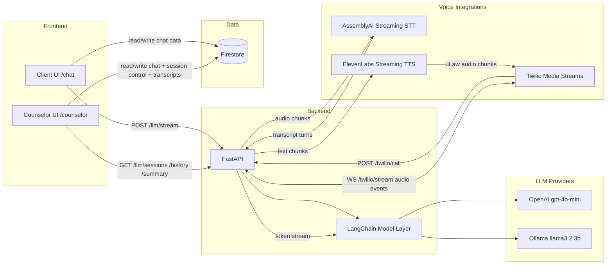

# CrisisLine Voice + Chat Support Platform

A multi-channel crisis support system that combines realtime web chat, counselor takeover controls, and voice-call AI orchestration. It is designed to keep people engaged while live counselors are occupied, then hand control to humans when needed.

## Why This Project
Crisis support workflows often face wait-time gaps. This project explores how an AI-first intake layer can provide immediate, empathetic interaction across chat and voice, while preserving a clear path for counselor intervention and review.

What makes it notable: it combines browser-based realtime chat operations, session-level control switching (`"ai" | "counselor"`), streaming LLM output, and telephony voice streaming in a single architecture.

## Key Capabilities
- Client chat with realtime Firestore synchronization.
- AI reply streaming over Server-Sent Events (SSE) with persistent message storage.
- Counselor dashboard with session selection, unread tracking, and AI-to-counselor takeover.
- Session summary generation with structured risk-level output.
- Voice call pipeline: Twilio media stream + AssemblyAI STT + LLM + ElevenLabs TTS.
- Transcript retrieval from backend sessions and persistence into Firestore.

## Architecture Overview


### Primary Flows
- Text chat flow:
  1. Client sends a message to Firestore (`chat_messages`).
  2. Frontend calls `POST /llm/stream` and receives `data:` chunks.
  3. Completed AI reply is saved back to Firestore as `uid = "ai_counselor"`.
- Counselor takeover flow:
  1. Counselor sets `chat_sessions/{clientUid}.handlerMode = "counselor"`.
  2. Client listener detects mode switch and aborts active AI stream.
  3. Counselor replies are written to Firestore as admin messages.
- Voice call flow:
  1. Twilio invokes `POST /twilio/call`, then opens `WS /twilio/stream`.
  2. Audio is transcribed by AssemblyAI streaming client.
  3. Final turns trigger LLM streaming output.
  4. LLM tokens are converted to streaming TTS audio and sent back to Twilio.

## Tech Stack
| Layer | Technologies | Purpose |
|---|---|---|
| Frontend | Next.js 16, React 19, TypeScript, Tailwind CSS v4 | Client and counselor web experiences |
| Auth + Data | Firebase Auth, Firestore | Identity, realtime chat/session/transcript storage |
| Backend API | FastAPI, Pydantic | Chat, summary, and Twilio endpoints |
| LLM Orchestration | LangChain, langchain-openai, langchain-ollama | Session history + model abstraction |
| Voice Pipeline | Twilio Media Streams, AssemblyAI Streaming STT, ElevenLabs Streaming TTS | Live voice conversation loop |
| Containerization | Docker, Docker Compose | Multi-service local deployment |

## Repository Structure
```text
.
├── backend/
│   ├── app/
│   │   ├── dependencies/    # FastAPI dependency injection (model access)
│   │   ├── model/           # LLM, STT, TTS integration logic
│   │   ├── routes/          # /llm and /twilio route handlers
│   │   └── service/         # Service orchestration for chat and Twilio stream
│   ├── main.py              # FastAPI app bootstrap + CORS + startup warmup
│   └── requirements.txt
├── frontend/
│   ├── src/app/(client)/    # Client-facing routes (chat experience)
│   ├── src/app/(counselor)/ # Counselor dashboard and transcript views
│   ├── src/app/components/  # Shared UI components
│   └── src/lib/             # Firebase and auth context
├── docker-compose.yml       # Runs frontend + backend services
└── README.md
```

## Local Setup
### Prerequisites
- Node.js 20+
- npm
- Python 3.10+
- Firebase project (Auth + Firestore)
- API keys for configured providers

### 1) Backend (FastAPI)
```bash
cd backend
python3 -m venv .venv
source .venv/bin/activate
pip install -r requirements.txt
uvicorn main:app --host 0.0.0.0 --port 1000 --reload
```

### 2) Frontend (Next.js)
```bash
cd frontend
npm install
npm run dev
```

Frontend runs on `http://localhost:3000` by default.

### 3) Docker Compose (optional)
From repository root:
```bash
docker compose up --build
```

Services are mapped to:
- Frontend: `http://localhost:3000`
- Backend: `http://localhost:1000`

## Environment Variables
Use placeholder values only. Do not commit secrets.

### Frontend (`frontend/.env.local`)
| Variable | Purpose |
|---|---|
| `NEXT_PUBLIC_API_BASE_URL` | Backend base URL for client chat and summary calls |
| `NEXT_PUBLIC_FIREBASE_API_KEY` | Firebase web app API key |
| `NEXT_PUBLIC_FIREBASE_AUTH_DOMAIN` | Firebase auth domain |
| `NEXT_PUBLIC_FIREBASE_PROJECT_ID` | Firebase project ID |
| `NEXT_PUBLIC_FIREBASE_STORAGE_BUCKET` | Firebase storage bucket |
| `NEXT_PUBLIC_FIREBASE_MESSAGING_SENDER_ID` | Firebase messaging sender ID |
| `NEXT_PUBLIC_FIREBASE_APP_ID` | Firebase web app ID |

### Backend (`backend/.env`)
| Variable | Purpose |
|---|---|
| `OPEN_AI_APIKEY` | OpenAI key for `gpt-4o-mini` (if absent, Ollama fallback is used) |
| `ASSEMBLYAI_API_KEY` | AssemblyAI streaming speech-to-text |
| `XI_API_KEY` | ElevenLabs streaming text-to-speech |
| `TWILIO_ACCOUNT_SID` | Twilio account identifier |
| `TWILIO_AUTH_TOKEN` | Twilio auth token |
| `TWILIO_PHONE_NUMBER` | Twilio phone number |
| `NGROK` | Public tunneling reference for telephony/webhook workflows |
| `LANGCHAIN_API_KEY` | Optional LangChain tracing/telemetry |
| `LANGCHAIN_PROJECT` | Optional LangChain project label |
| `GOOGLE_MAPS_API_KEY` | Reserved/in-progress integration |
| `GOOGLE_SPEECH_TO_TEXT` | Reserved/in-progress integration |
| `MAP_BOX` | Reserved/in-progress integration |

## Data Model and Realtime Behavior
### Firestore Collections
- `chat_messages`
  - Core message log for client, AI, and counselor messages.
  - Common fields: `message`, `uid`, `clientUid`, `createdAt`, `source`, `channelType`.
- `chat_sessions`
  - Session-control documents keyed by `clientUid`.
  - Used for handler switching via `handlerMode` (`"ai"` or `"counselor"`).
- `call_transcripts`
  - Counselor transcript snapshots fetched from backend (`/llm/sessions`, `/llm/history`) and persisted for review.
  - Can include `riskLevel` from summary analysis.
- `case_cards` and `users`
  - Expected by setup documentation for broader workflow expansion.

### Handler Mode Control
- `chat_sessions/{clientUid}.handlerMode` drives who responds.
- Client defaults to AI mode when session control is absent/invalid.
- If counselor mode is activated during AI streaming, client aborts in-flight stream.

### Required Composite Index
For stable ordered realtime history queries, create this Firestore index:
- Collection: `chat_messages`
- Fields:
  - `clientUid` ascending
  - `createdAt` ascending

Compatibility behavior:
- If the composite index is missing, client falls back to a non-ordered query and sorts in memory.

## API Reference (Concise)
### HTTP Endpoints
| Method | Path | Purpose | Request (key fields) | Response (brief) |
|---|---|---|---|---|
| `POST` | `/llm/chat` | One-shot chat reply | `{ message, session_id }` | `{ response, session_id }` |
| `POST` | `/llm/stream` | Streaming AI reply (SSE) | `{ message, session_id }` | `text/event-stream` with `data:` chunks and final `data: [DONE]` |
| `GET` | `/llm/history/{session_id}` | Session conversation history | Path `session_id` | `{ session_id, messages: [{ role, content }] }` |
| `GET` | `/llm/sessions` | List known session IDs | None | `{ sessions: string[] }` |
| `GET` | `/llm/summary/{session_id}` | Structured session summary | Path `session_id` | `{ summary: { ...risk fields... } }` or no-history string |
| `POST` | `/twilio/call` | Return TwiML stream instructions | Twilio webhook request | XML TwiML with `<Connect><Stream ...>` |

### WebSocket Endpoint
| Path | Purpose | Notes |
|---|---|---|
| `WS /twilio/stream` | Bidirectional Twilio media stream handling | Handles `start`, `media`, `stop` events and relays STT/LLM/TTS pipeline |

## Frontend Route Surfaces
- `/chat`: Client chat UI with realtime Firestore history and AI streaming.
- `/counselor`: Counselor dashboard with authentication gate, live conversation list, takeover controls, transcript panel, and summary overlay.
- `/counselor/chat/[sessionId]`: Placeholder session route.
- `/counselor/chat/call/[callSessionId]`: Placeholder call-session route.

## Skills Demonstrated
- Multi-channel conversational system design across web chat and telephony.
- Realtime data architecture with Firestore listeners and operational fallbacks.
- Streaming UX implementation using SSE with abort/cancellation control.
- Voice AI orchestration over websocket audio streams (STT -> LLM -> TTS).
- Structured risk triage generation from session history.
- Containerized full-stack service composition for local deployment.

## Known Limitations and Next Steps
### Current Limitations
- Counselor authentication currently uses hardcoded local credentials in frontend source.
- Counselor transcript-fetch workflow uses hardcoded `http://localhost:1000` backend URLs.
- Twilio route currently uses a hardcoded ngrok websocket URL for streaming.
- Backend CORS is open to all origins (`allow_origins=["*"]`).
- Backend conversation history is in-memory and resets on process restart.
- No formal automated test suite is present; frontend lint currently reports warnings/errors.

### Recommended Next Steps
1. Replace hardcoded credentials with Firebase/Auth provider-based role access.
2. Move all backend URL and Twilio stream host configuration to environment variables.
3. Restrict CORS origins by environment and deploy context.
4. Persist LLM session history to a durable datastore.
5. Add backend and frontend automated tests (unit + integration).
6. Add CI checks for lint/test/build gating.

## Quick Demo Script (Portfolio Review)
1. Start backend (`uvicorn`) and frontend (`npm run dev`) or run `docker compose up --build`.
2. Open `http://localhost:3000/chat` and send a few client messages.
3. Observe AI responses streaming into the chat window.
4. Open `http://localhost:3000/counselor` in a second tab/window and sign in with local admin credentials configured in source.
5. Select the active client session and trigger counselor takeover.
6. Send a counselor reply and verify the client thread reflects counselor-authored messages.
7. Use transcript fetch + summary in counselor view to review conversation risk metadata.
